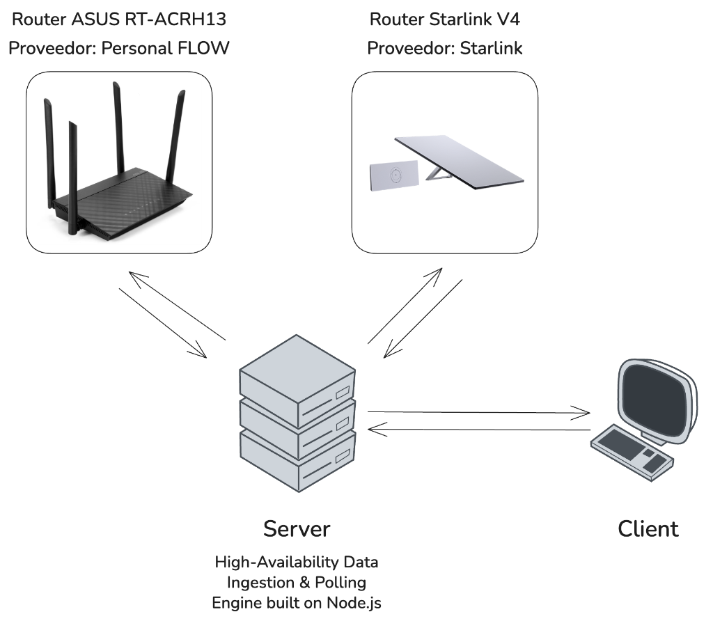

# NetworkMonitor 📡

A minimalist, high-performance monitoring solution for dual-WAN environments (Starlink & Personal Flow).

## Core Features

- **Automated Polling**: Real-time telemetry via SSH (Asus) and REST API (Starlink).
- **NOC Dashboard**: Premium glassmorphism interface with real-time Traffic Timelines.
- **Live Console**: Integrated terminal emulator for system logs and status debugging.
- **Local Persistence**: Zero-dependency data storage using localized JSON snapshots.

## Technical Stack

- **Backend**: Node.js, Express, SSH2, Node-cron.
- **Frontend**: Vanilla JS, Chart.js, CSS3 (Glassmorphism).

---
*Built for 24/7 network oversight on low-power hardware.*
